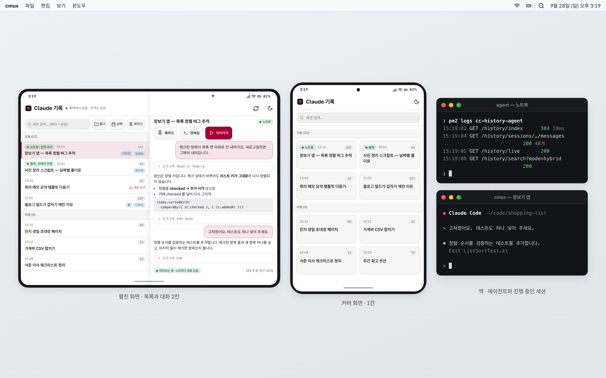
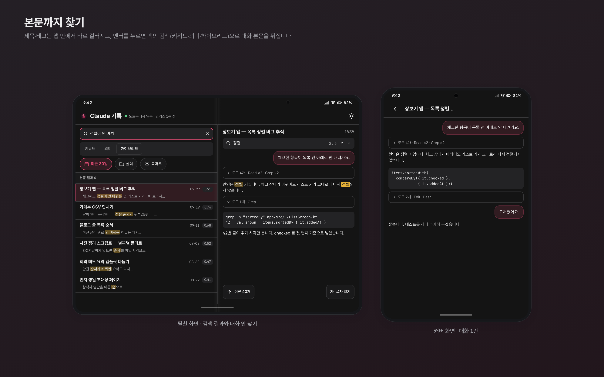
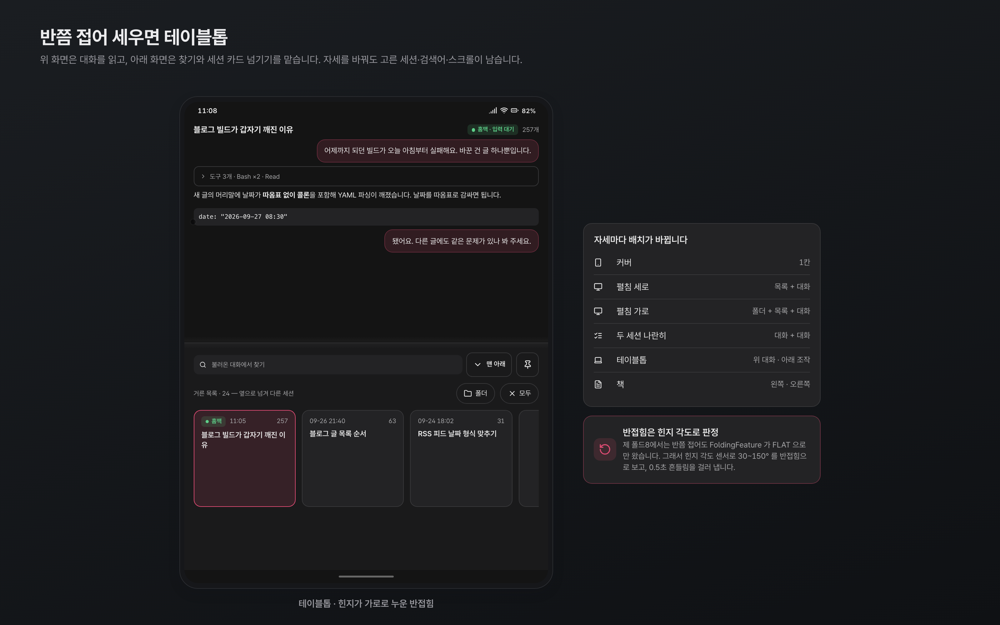
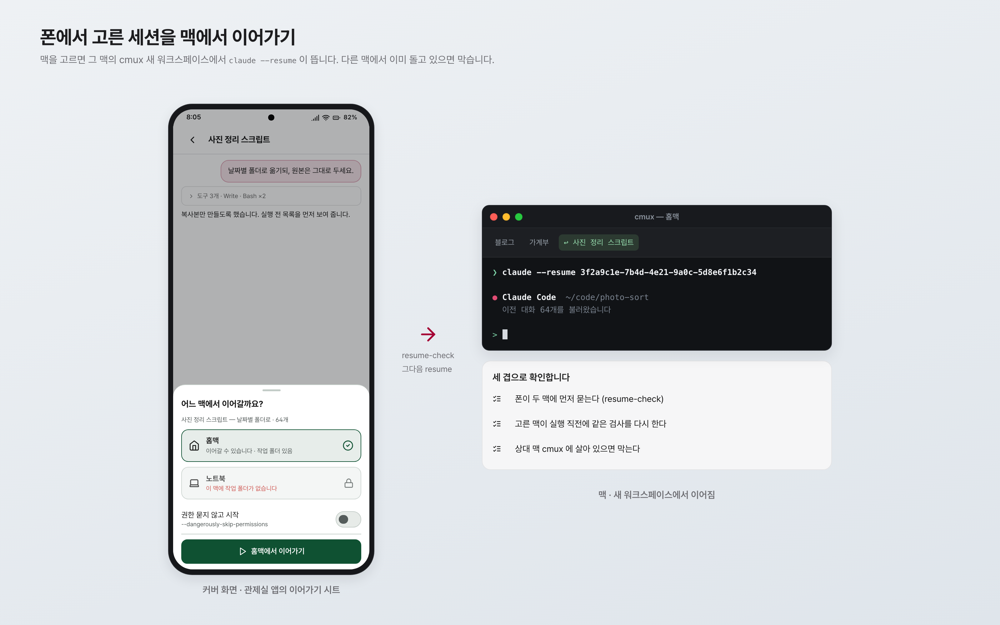
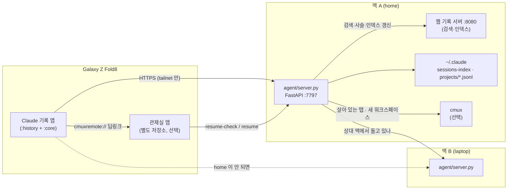

# Claude 기록 (fold-claude-history)

두 맥에 쌓인 Claude Code 대화 기록을 갤럭시 Z 폴드8에서 찾고, 읽고, 맥에서 이어가게 하는 안드로이드 앱과 맥 쪽 에이전트입니다.

> **English** — A native Jetpack Compose viewer for Claude Code session history, built for the Galaxy Z Fold8.
> It reads sessions from one or two Macs through a small FastAPI agent, and lays itself out per posture (cover 1 pane, unfolded 2–3 panes, tabletop, book).
> From the phone you can hand a session back to a Mac: it opens `claude --resume` in a new cmux workspace, and refuses if the session is already running on the other Mac.

동작 확인: Galaxy Z Fold8 (Android 17) · macOS 26


화면은 설명용 목업입니다.

## 왜 만들었나

저는 10년 넘게 아이폰을 쓰다가 올해 갤럭시 Z 폴드8로 바꿨습니다. 맥은 그대로 쓰기 때문에, 아이폰 시절 당연하던 맥 연동을 하나씩 제가 직접 만들어 보고 있습니다. 이 저장소는 그중 하나입니다.

저는 Claude Code 세션을 노트북과 집에 있는 맥 두 대에서 돌립니다. 맥에서는 웹 기반 기록 뷰어로 지난 대화를 찾아 읽는데, 자리를 비운 사이에 «그때 그 세션에서 뭐라고 했더라»를 폰으로 확인하고 싶었습니다. 폴드는 접으면 좁은 폰, 펴면 작은 태블릿이라 화면 배치를 자세마다 다르게 가져가야 했고, 그래서 웹 뷰어를 폰에 띄우는 대신 네이티브 앱으로 다시 만들었습니다.

## 스크린샷


화면은 설명용 목업입니다.


화면은 설명용 목업입니다.


화면은 설명용 목업입니다.

## 기능

- **세션 목록**: 두 맥 중 먼저 닿는 쪽(기본은 `home`, 안 되면 `laptop`)의 기록 인덱스를 받습니다. gzip + ETag 로 받고, 바뀌지 않았으면 304 로 끝납니다. 폰에도 캐시해서 맥이 꺼져 있어도 마지막 목록은 보입니다. 제 기록 약 2,840개 기준으로 목록이 gzip 711KB, 다시 부를 때 304 응답이 19ms 였습니다.
- **검색과 필터**: 제목·태그·설명은 앱 안에서 바로 거르고, 엔터를 누르면 맥의 기록 서버에 본문 검색(키워드·의미·하이브리드)을 보냅니다. 폴더·날짜·태그·북마크·«cmux 에 열려 있음» 필터가 있습니다.
- **대화 읽기**: 대화 파일을 뒤에서부터 40개씩 읽습니다. 마크다운(표·코드 포함)을 외부 라이브러리 없이 Compose 로 그리고, 도구 호출은 접어 둡니다. cmux 에서 살아 있는 세션은 4초마다 꼬리를 새로 읽는 따라보기, 대화 안 찾기, 글자 크기 조절이 있습니다.
- **폴드 자세별 배치**: 커버 1칸 · 펼침 세로 2칸 · 펼침 가로 3칸 · 두 세션 나란히 · 테이블톱(위 대화 / 아래 찾기와 세션 카드) · 책. 칸 경계 레일을 눌러 접거나 끌어서 폭을 바꿉니다. 자세를 바꿔도 고른 세션·검색어·스크롤이 남습니다.
- **살아 있음 배지**: 지금 맥의 cmux 에서 돌고 있는 세션에 «노트북 · 입력 대기» 같은 배지가 붙습니다(cmux 연동을 켠 경우).
- **북마크**: 앱의 유일한 쓰기입니다. 맥의 `~/.claude/session-bookmarks.json` 에 저장해 웹 뷰어와 같이 씁니다.
- **관제실 연동**: `cchistory://session/{sid}` 딥링크로 열리고, 제 관제실 앱(cmux 모바일 관제실, [허브](https://github.com/joonlab/android-mac-lab)에서 소개)이 깔려 있으면 «관제실»·«이어가기» 버튼이 보입니다. 이어가기는 맥을 고르면 그 맥의 cmux 새 워크스페이스에서 `claude --resume <sid>` 를 띄웁니다.

## 구조



| 경로 | 내용 |
|---|---|
| `android/history/` | 기록 앱(`kr.joonlab.cchistory`). 자세 판정 `Posture.kt`, 목록 `ListUi.kt`, 대화 `ConvUi.kt`, 상태 `State.kt`, API `Data.kt` |
| `android/core/` | 연결(`Agent.kt`)·테마 주입·글자 크기·칸 레일·아이콘·마크다운·Pretendard |
| `agent/history.py` | `/api/v1/history/*` — 목록·대화 페이지·사슬·검색·살아 있는 탭·북마크 |
| `agent/transcript.py` | 대화 `.jsonl` 을 뒤에서부터 청크로 읽어 채팅 항목으로 |
| `agent/resume.py` | 이어가기 판정(이미 여기서 도는가 · 다른 맥에서 도는가 · 작업 폴더가 있는가) |
| `agent/server.py` | 위를 묶는 최소 FastAPI 서버 |
| `agent/cmux_bridge.py` | cmux 연동(선택) — cmux-state-dashboard 를 불러 씀 |
| `docs/mockups/` | README 스크린샷 목업의 HTML 원본. 렌더에 쓴 공용 스타일 킷은 이 저장소에 없어서(`mockup-kit.invalid` 자리표시), 그대로 열면 스타일이 빠집니다 |
| `android/tools/` | Heroicons·lucide 아이콘 생성기, 에뮬레이터 6자세 캡처 스크립트 |

## 준비물

- Galaxy Z Fold 계열 또는 Android 11(API 30) 이상 기기. 폴드가 아니어도 뜨지만 자세별 배치는 폴더블에서만 의미가 있습니다.
- 맥 1~2대: Python 3.10+, Claude Code 기록(`~/.claude/projects`)
- 맥의 웹 기록 서버(`:8080`)와 `~/.claude/sessions-index.json` — 저는 Claude Code 기록 뷰어(`history-server.py`)를 씁니다. 에이전트는 이 서버에 검색·인덱스 갱신·세션 사슬을 **부르기만** 합니다. 이 서버는 이 저장소에 들어 있지 않습니다.
- 폰에서 맥에 닿는 HTTPS 경로. 저는 Tailscale 의 `tailscale serve` 를 씁니다.
- (선택) [cmux](https://github.com/manaflow-ai/cmux) + [cmux-state-dashboard](https://github.com/joonlab/cmux-state-dashboard) — «살아 있음» 배지와 이어가기에 필요합니다.
- 빌드: JDK 21, Android SDK 36, AGP 9.4.1, Kotlin(Compose 플러그인) 2.4.20

## 설치와 설정

### 1) 맥 — 에이전트

```bash
cd agent
python3 -m venv .venv && .venv/bin/pip install -r requirements.txt
cp config.example.json config.json      # machine · peers · send 를 채운다
.venv/bin/python -m uvicorn server:app --host 127.0.0.1 --port 7797
# 상시 실행은 pm2: pm2 start ecosystem.config.js
```

`config.json` 의 값:

| 키 | 뜻 |
|---|---|
| `machine` | 이 맥의 이름. 앱과 맞춰 `home` 또는 `laptop` |
| `peers` | 상대 맥 에이전트 주소. 키는 **이 맥의** `machine` 값이고 값은 상대 맥의 이름·URL 입니다(예시 파일 참고). 이어가기 전에 «상대 cmux 에서 이미 돌고 있나»를 직접 묻는 데 씁니다 |
| `send` | `off`(기본)면 이어가기를 막습니다. 켜려면 `on` |
| `hand_lib` | 선택. 세션 소유 기록(사이드카)을 읽는 제 개인 스크립트용 자리입니다. 비워 두면 그 검사만 건너뜁니다 |

환경변수 `CMR_MACHINE` · `CMR_SEND` · `CMR_PEER_URL` · `CMR_HAND_LIB` · `CMR_CLAUDE_DIR` · `CMR_HISTORY_URL` 이 있으면 설정 파일보다 우선합니다.

에이전트에는 인증이 없습니다. **127.0.0.1 에만 띄우고**, 폰에서는 tailnet 같은 내 기기끼리의 망으로만 닿게 해 주세요.

```bash
tailscale serve --bg --https=8797 http://127.0.0.1:7797
```

cmux 연동을 쓰려면 저장소 루트에서:

```bash
git clone https://github.com/joonlab/cmux-state-dashboard vendor/cmux-dash
```

### 2) 폰 — 앱

```bash
cd android
cp agent.properties.example agent.properties   # 두 맥의 HTTPS 주소를 채운다
./dev.sh build        # 또는 ./gradlew :history:assembleDebug
./dev.sh run          # adb 로 연결된 폰에 설치하고 실행
```

`agent.properties` 는 빌드할 때 `BuildConfig` 로 들어갑니다. 한 대만 쓰면 `cchistory.home.url` 만 채우면 됩니다.

### 테스트

```bash
cd agent && .venv/bin/pip install pytest && .venv/bin/python -m pytest tests
```

에이전트 테스트는 임시 폴더를 가짜 `~/.claude` 로 쓰고, 진짜 기록은 읽지 않습니다(기록 API 10건, 이어가기 판정 5건).

## 알려진 한계

- **혼자 쓰려고 만든 도구입니다.** 두 맥 이름이 `home`·`laptop` 으로 고정돼 있고, 맥의 웹 기록 서버(`:8080`)가 있어야 검색·인덱스 갱신이 됩니다. 그 서버는 이 저장소에 없습니다.
- 읽기 전용입니다. 폰에서 쓰는 건 북마크 하나뿐이고, 이름·태그·폴더 편집은 맥의 웹 뷰어에서 합니다.
- 권한 요청·질문으로 막힌 세션을 폰 알림으로 알려 주는 기능은 아직 없습니다.
- 목록의 «진행 중» 표시는 맥이 인덱스를 새로 만들 때까지 남아 있을 수 있습니다.
- 압축으로 이어진 세션은 사슬의 끝 파일만 읽히는 경로가 남아 있습니다.
- 테이블톱 자세의 «관제실»·«이어가기» 버튼은 빌드로만 확인했고 폰에서 눌러 보지는 않았습니다. 이어가기는 노트북에서 실측했고, 홈맥에서 실제로 되살리는 경로는 차단 쪽만 확인했습니다.
- 다크 테마에서 토스트 대비와 accent 대비가 낮다는 점검 결과가 있고, 아직 고치지 않았습니다.
- 에이전트에 인증이 없습니다. 공개 인터넷에 열면 안 됩니다.

## 만든 과정

2026년 9월 25일 하루, 약 7시간 동안 Claude Code 세션 5개를 이어 붙여 만들었습니다. 설계(M0) → 기록 API(M1) → 공용 모듈 분리(M2) → 앱 골격(M3) → 폴드 자세(M4) → 관제실 연동(M5) 순서였고, 세션이 끝날 때마다 핸드오프 문서를 남겨 다음 세션이 그것부터 읽게 했습니다.

부딪힌 것 중 기억에 남는 것:

1. **4GB 대화 파일.** 오래 쓴 세션 하나가 4GB 였고, 끝 50MB 안에 줄이 53개뿐이었습니다(한 줄 평균 1MB). 최근 40개를 모으려고 거대한 줄을 통째로 읽다가 에이전트가 604MB 까지 올라 재시작됐습니다. 한 줄이 상한을 넘으면 머리만 보고 건너뛰게 바꿔서 109MB · 1.2초로 줄였습니다.
2. **폴드8은 반쯤 접어도 FoldingFeature 가 FLAT 이었습니다.** 제 기기에서는 Jetpack WindowManager 가 반접힘을 알려 주지 않아서, 힌지 각도 센서(`TYPE_HINGE_ANGLE`)로 30~150° 를 반접힘으로 판정하고 0.5초 디바운스를 걸었습니다. 폴더블 에뮬레이터에서 6자세 매트릭스(`android/tools/emu-posture-matrix.sh`)로 다시 확인했습니다.
3. **맥의 기록 인덱스가 몇 시간씩 멈춰 있었습니다.** 웹 기록 서버는 브라우저에 뷰어가 열려 있을 때만 인덱스를 갱신했습니다. 아무도 뷰어를 안 여는 맥은 3시간 40분 전 목록을 주고 있었습니다. 그래서 에이전트가 목록을 줄 때 인덱스가 오래됐으면 직접 갱신을 요청하게 했습니다.
4. **`claude -r` 대신 `--resume`.** 이어가기로 띄운 탭을 cmux 대시보드가 세션과 잇지 못했는데, 대시보드는 명령줄의 `--resume`/`--session-id` 만 읽었기 때문입니다. 안드로이드 쪽에서는 관제실 앱을 찾으려고 `<queries>` 에 스킴만 적었다가 가시성이 안 열려서, 호스트까지 적어야 했습니다.

<!-- VIDEO -->

## 관련 프로젝트

- 허브: https://github.com/joonlab/android-mac-lab — 폴드8과 맥을 잇는 제 다른 실험들
- cmux 상태 대시보드: https://github.com/joonlab/cmux-state-dashboard

## 라이선스

MIT — [LICENSE](LICENSE). 함께 들어 있는 글꼴·아이콘의 라이선스는 [THIRD_PARTY_NOTICES.md](THIRD_PARTY_NOTICES.md).
